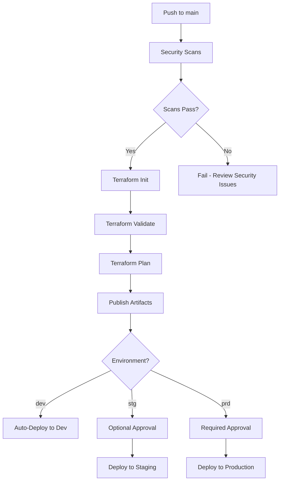

# Common Terraform Pipeline Template - Usage Guide

## 📋 Overview

This is a **company-wide reusable Terraform pipeline template** for deploying Azure infrastructure across multiple environments (dev, stg, prd, data, int) with built-in security scanning, approval gates, and standardized workflows.

## 🎯 Features

✅ **Multi-Environment Support** - dev, stg, prd, data, int environments
✅ **Security Scanning** - Terrascan & Checkov integrated
✅ **Approval Gates** - Environment-based manual approvals
✅ **Self-Hosted Agents** - Cost-effective WSL-Agent pool
✅ **Centralized State** - PRD subscription backend for all environments
✅ **Artifact Publishing** - Plan files saved for audit trail
✅ **Azure AD Authentication** - Secure authentication with managed identities

## 🚀 How to Use This Template in Your Project

### Step 1: Copy Pipeline Files

Copy these files to your Terraform repository:

```bash
# Copy the entire .azuredevops folder structure
.azuredevops/
├── pipelines/
│   └── terraform-pipeline.yml      # Main pipeline
└── templates/                       # (if you have template files)
```

### Step 2: Configure Project Structure

Ensure your project follows this structure:

```
your-terraform-project/
├── .azuredevops/
│   └── pipelines/
│       └── terraform-pipeline.yml
├── terraform/
│   ├── modules/                    # Your Terraform modules
│   │   ├── module1/
│   │   ├── module2/
│   │   └── ...
│   ├── environments/               # Environment-specific tfvars
│   │   ├── dev.tfvars
│   │   ├── stg.tfvars
│   │   ├── prd.tfvars
│   │   ├── data.tfvars
│   │   └── int.tfvars
│   ├── main.tf
│   ├── variables.tf
│   ├── outputs.tf
│   └── providers.tf
```

### Step 3: Create Variable Group

In Azure DevOps, create a variable group named `TerraformSecrets`:

**Pipelines** → **Library** → **+ Variable group**

**Required Variables:**

| Variable Name | Description | Example | Secret? |
|--------------|-------------|---------|---------|
| `TENANT_ID` | Azure AD Tenant ID | `xxxxxxxx-xxxx-xxxx-xxxx-xxxxxxxxxxxx` | No |
| `SUBSCRIPTION_ID_PRD` | Production subscription (for state backend) | `xxxxxxxx-xxxx-xxxx-xxxx-xxxxxxxxxxxx` | No |
| `SUBSCRIPTION_ID_dev` | Dev environment subscription | `xxxxxxxx-xxxx-xxxx-xxxx-xxxxxxxxxxxx` | No |
| `SUBSCRIPTION_ID_stg` | Staging environment subscription | `xxxxxxxx-xxxx-xxxx-xxxx-xxxxxxxxxxxx` | No |
| `SUBSCRIPTION_ID_prd` | Production environment subscription | `xxxxxxxx-xxxx-xxxx-xxxx-xxxxxxxxxxxx` | No |
| `SUBSCRIPTION_ID_data` | Data environment subscription | `xxxxxxxx-xxxx-xxxx-xxxx-xxxxxxxxxxxx` | No |
| `SUBSCRIPTION_ID_int` | Integration environment subscription | `xxxxxxxx-xxxx-xxxx-xxxx-xxxxxxxxxxxx` | No |
| `TF_STORAGE_RESOURCE_GROUP` | State storage resource group name | `rg-tfstate-prd-uaenorth-001` | No |
| `TF_STORAGE_ACCOUNT_NAME` | State storage account name | `sttfstateprd001` | No |
| `TF_CONTAINER_NAME` | State blob container name | `tfstate` | No |

### Step 4: Create Service Connection

**Project Settings** → **Service connections** → **New service connection**

- **Type**: Azure Resource Manager
- **Authentication**: Service Principal (automatic)
- **Subscription**: Your PRD subscription (for backend state access)
- **Name**: `svc-azure-devops`
- **Grant access to all pipelines**: ☑️

### Step 5: Create Environments with Approvals

**Pipelines** → **Environments** → **New environment**

Create these environments:

| Environment Name | Approval Required? | Description |
|-----------------|-------------------|-------------|
| `MR-Approval-dev` | ❌ No | Development - auto-deploy |
| `MR-Approval-stg` | ⚠️ Optional | Staging - optional approval |
| `MR-Approval-prd` | ✅ Yes | Production - requires approval |
| `MR-Approval-data` | ✅ Yes | Data - requires approval |
| `MR-Approval-int` | ⚠️ Optional | Integration - optional approval |

**For production environments:**
1. Click on environment → **Approvals and checks**
2. Click **+** → **Approvals**
3. Add approvers (DevOps lead, Product owner, etc.)
4. Configure:
   - ☑️ **Allow approvers to approve their own runs**: ❌ (for production)
   - ☑️ **Timeout**: 30 days
   - ☑️ **Instructions**: "Approve deployment to PRD environment"

### Step 6: Configure Agent Pool Access

If using self-hosted agents (WSL-Agent):

**Organization Settings** → **Agent pools** → **WSL-Agent** → **Security**

- Add your project with **User** role
- Grant pipeline access: ☑️ **Grant access permission to all pipelines**

### Step 7: Create Environment-Specific .tfvars Files

Create `.tfvars` files for each environment in `terraform/environments/`:

**Example: `dev.tfvars`**
```hcl
# Dev Environment Configuration
resource_name_environment = "dev"
location                  = "uaenorth"

# Network Configuration
address_space = ["172.0.0.0/18"]
subnets = {
  aks = {
    address_prefix = "172.0.0.0/20"
  }
  appgw = {
    address_prefix = "172.0.16.0/24"
  }
}

# Tags
tags = {
  environment = "dev"
  project     = "your-project-name"
  managed_by  = "terraform"
  cost_center = "engineering"
}

# Note: tenant_id and subscription_id will be appended by pipeline
```

**Repeat for:** `stg.tfvars`, `prd.tfvars`, `data.tfvars`, `int.tfvars`

### Step 8: Create the Pipeline in Azure DevOps

1. **Pipelines** → **Create Pipeline**
2. Select **Azure Repos Git** (or GitHub if using GitHub)
3. Choose your repository
4. Select **Existing Azure Pipelines YAML file**
5. Path: `/.azuredevops/pipelines/terraform-pipeline.yml`
6. Click **Continue**
7. Review and click **Save** (or **Run** if ready)

### Step 9: Run the Pipeline

1. Go to **Pipelines** → Select your pipeline
2. Click **Run pipeline**
3. Select environment from dropdown:
   - `dev`
   - `stg`
   - `prd`
   - `data`
   - `int`
4. Click **Run**

## 🔄 Pipeline Workflow



## 📝 Environment Variable Naming Convention

The pipeline uses dynamic environment variable references:

```yaml
# In pipeline parameter
environment: 'dev'

# Resolves to variable group variable
SUBSCRIPTION_ID_dev

# For production
environment: 'prd'
SUBSCRIPTION_ID_prd
```

**Important:** Variable names must follow this pattern: `SUBSCRIPTION_ID_{environment}`

## 🔐 Security Best Practices

### Backend State Management

- ✅ **Centralized State**: All environments use PRD subscription for state storage
- ✅ **Azure AD Auth**: Use `use_azuread_auth = true` (no storage keys)
- ✅ **Separate State Files**: Each environment has its own `.tfstate` file
- ✅ **Versioning Enabled**: Enable blob versioning on state storage account

### Service Principal Permissions

Ensure your service principal has:

| Resource | Permission | Scope |
|----------|-----------|-------|
| State Storage Account | Storage Blob Data Contributor | PRD Subscription |
| Target Subscriptions | Contributor | Per Environment |
| Key Vaults | Key Vault Administrator | Per Environment |

### Secrets Management

- ❌ **Never** commit `.tfvars` files with secrets
- ✅ Use variable groups for sensitive data
- ✅ Mark sensitive variables as **Secret** 🔒
- ✅ Use Azure Key Vault for application secrets
- ✅ Reference secrets in Terraform:
  ```hcl
  data "azurerm_key_vault_secret" "example" {
    name         = "secret-name"
    key_vault_id = azurerm_key_vault.example.id
  }
  ```

## 🛠️ Customization Options

### Add More Environments

1. Add new parameter value:
   ```yaml
   parameters:
   - name: environment
     values:
     - dev
     - stg
     - prd
     - data
     - int
     - qa      # Add new environment
   ```

2. Add variable to `TerraformSecrets` group:
   - `SUBSCRIPTION_ID_qa`

3. Create `terraform/environments/qa.tfvars`

4. Create environment `MR-Approval-qa` in Azure DevOps

### Change Agent Pool

If not using WSL-Agent, update all `pool` references:

```yaml
pool:
  name: 'WSL-Agent'  # Change to your pool name
  demands:
  - Agent.Name -equals Dell-Predator-G15-5530  # Remove if not needed
```

Or use Microsoft-hosted agents:

```yaml
pool:
  vmImage: 'ubuntu-latest'
```

### Disable Security Scans

Comment out or remove the `Security_Scans` stage:

```yaml
# stages:
# - stage: Security_Scans
#   displayName: "Run Terrascan & Checkov Scans"
#   ...
```

Update stage dependencies:

```yaml
- stage: Prepare_Terraform_Release
  dependsOn: []  # Remove dependency on Security_Scans
```

### Add Post-Deployment Tests

Add a new stage after `Terraform_Apply`:

```yaml
- stage: Integration_Tests
  displayName: "Run Integration Tests"
  dependsOn: Terraform_Apply
  jobs:
  - job: TestJob
    displayName: "Run Tests"
    steps:
      - script: |
          # Your test commands
          echo "Running integration tests..."
        displayName: "Execute Tests"
```

## 📊 Monitoring and Alerts

### Pipeline Notifications

**Project Settings** → **Notifications** → **New subscription**

Recommended notifications:
- ✅ **Pipeline failed** → Email team
- ✅ **Deployment pending approval** → Email approvers
- ✅ **Security scan found issues** → Slack channel

### Cost Tracking

Tag all resources with:
```hcl
tags = {
  environment = var.environment
  project     = "your-project"
  cost_center = "engineering"
  deployed_by = "terraform"
}
```

Use Azure Cost Management to track spending by tags.

## 🆘 Troubleshooting

### Issue: "Backend initialization failed"

**Solution:**
1. Verify storage account exists in PRD subscription
2. Check service principal has Storage Blob Data Contributor role
3. Verify variable group has correct values

### Issue: "Agent not found: Dell-Predator-G15-5530"

**Solution:**
1. Remove agent-specific demand if using different agents
2. Or ensure your agent is online in the WSL-Agent pool

### Issue: "Terraform plan failed - authentication error"

**Solution:**
1. Verify `SUBSCRIPTION_ID_{env}` variable exists for your environment
2. Check service connection has access to target subscription
3. Ensure service principal credentials haven't expired

### Issue: "Security scans taking too long"

**Solution:**
1. Scans run in parallel for all modules
2. Consider disabling scans for faster iterations
3. Or run scans only on PRs, not every commit

## 📚 Additional Resources

- [Terraform Azure Provider Documentation](https://registry.terraform.io/providers/hashicorp/azurerm/latest/docs)
- [Azure DevOps Pipelines Documentation](https://docs.microsoft.com/en-us/azure/devops/pipelines/)
- [Terrascan Documentation](https://runterrascan.io/docs/)
- [Checkov Documentation](https://www.checkov.io/documentation.html)

## 🤝 Support

For issues or questions about this pipeline template:
1. Check this guide first
2. Review pipeline run logs in Azure DevOps
3. Contact DevOps team: devops@jlurisenterprise.com
4. Open a ticket in your internal support system

---

**Template Version**: 1.0  
**Last Updated**: November 12, 2025  
**Maintained By**: Infrastructure & DevOps Team  
**Organization**: jlurisenterprise
